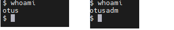
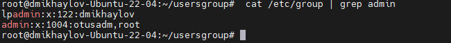

# users-and-groups
1. Поднимаем машину ``` vagrant up ```
2. Подключаемся к машине. Создаём пользователя otusadm и otus задаем им пароли.  Создаём группу admin: ``` groupadd -f admin ```.  Добавляем пользователей vagrant,root и otusadm в группу admin
3.  ``` usermod otusadm -a -G admin && usermod root -a -G admin && usermod vagrant -a -G admin ```
4.  Пробуем войти в систему пользователями otus и otusadm
5.  
6.  Проверим, что пользователи root и otusadm есть в группе admin: ``` cat /etc/group | grep admin ```
7.  
8.  Создадим файл-скрипт /usr/local/bin/login.sh
9.   скрипте подписаны все условия. Скрипт работает по принципу: Если сегодня суббота или воскресенье, то нужно проверить, входит ли пользователь в группу admin, если не входит — то подключение запрещено. При любых других вариантах подключение разрешено.
10.   ``` chmod +x /usr/local/bin/login.sh ```
11.   Укажем в файле /etc/pam.d/sshd модуль pam_exec и наш скрипт:
12. ``` vim /etc/pam.d/sshd ```
13.  ```  "auth       substack     password-auth
auth       include      postlogin
auth required pam_exec.so debug /usr/local/bin/login.sh
account    required     dad
account    required     pam_nologin.so
account    include      password-auth
password   include      password-auth
# pam_selinux.so close should be the first session rule
session    required     pam_selinux.so close
session    required     pam_loginuid.so
# pam_selinux.so open should only be followed by sessions to be executed in the user context
session    required     pam_selinux.so open env_params
session    required     pam_namespace.so
session    optional     pam_keyinit.so force revoke
session    optional     pam_motd.so
session    include      password-auth
session    include      postlogin"
```
13. я добавил все это из методички. не знаю правильно это или нет.
14. проверяем: ставим на ОС дату - выходной день и пытаемся логиниться пользователем otus, и у нас ничего не получается.
15. 


