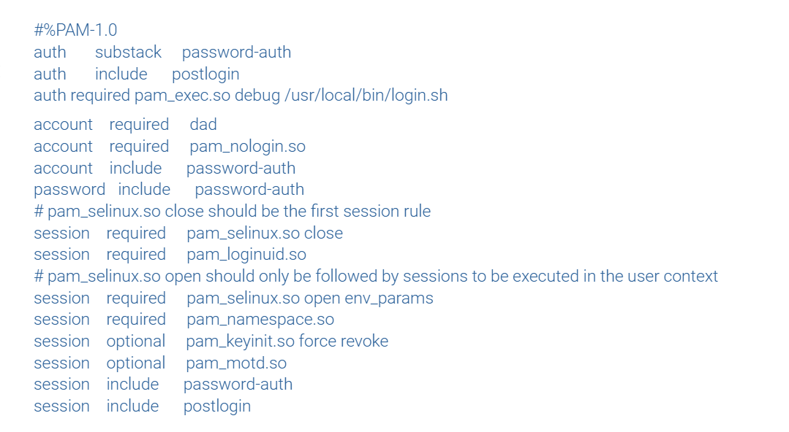

# users-and-groups
1. Поднимаем машину ``` vagrant up ```
2. Подключаемся к машине. Создаём пользователя otusadm и otus задаем им пароли.  Создаём группу admin: ``` groupadd -f admin ```.  Добавляем пользователей vagrant,root и otusadm в группу admin
3.  ``` usermod otusadm -a -G admin && usermod root -a -G admin && usermod vagrant -a -G admin ```
4.  Пробуем войти в систему пользователями otus и otusadm
5.  
6.  Проверим, что пользователи root и otusadm есть в группе admin: ``` cat /etc/group | grep admin ```
7.  
8.  Создадим файл-скрипт /usr/local/bin/login.sh
9.   скрипте подписаны все условия. Скрипт работает по принципу: Если сегодня суббота или воскресенье, то нужно проверить, входит ли пользователь в группу admin, если не входит — то подключение запрещено. При любых других вариантах подключение разрешено.
10.   ``` chmod +x /usr/local/bin/login.sh ```
11.   Укажем в файле /etc/pam.d/sshd модуль pam_exec и наш скрипт:
12. ``` vim /etc/pam.d/sshd ```
13. добавил из методички
14.  
15. проверяем: ставим на ОС дату - выходной день (сегодня выходной) и пытаемся логиниться пользователем otus, и у нас ничего не получается.
16. 


